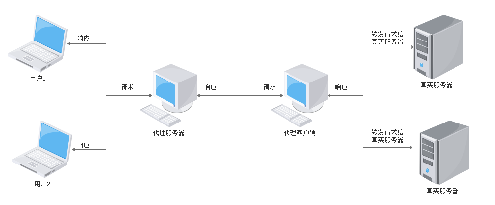

## proxy

proxy可以通过公网服务器访问内网主机，目前仅支持tcp流量转发（测试通过ssh,http,mysql应用的流量转发）
注:可以通过域名或者端口进行转发

如果需要通过外网访问内网主机（http或者mysql等），则需要把服务器端部署到公网服务器，然后添加端口或者域名映射。

虽然我们可以把应用直接部署到公网服务器，但是应用测试很麻烦，同时对服务器的配置要求也会很高，通过代理，只需要一个很简单的公网服务器，然后把请求转发到本地，这样方便测试开始应用程序。

### 配置文件

#### 服务端

proxy.yaml 文件

```
port: 6666
# 服务器ip
server: 67.216.203.138
#每秒 并发量
concurrent: 1000

#如果通过域名转发，则需要指定一个共用的http转发端口
httpPort: 9090
client:
		#客户端key
        ztgreat:
        		 #访问域名（通过域名访问）
               - domain: proxy.name.cn
               	 #代理类型
                 proxyType: http
                 #真实主机ip
                 realhost: 127.0.0.1
                 #真实主机端口
                 realhostport: 8081
                 description: http代理
                 
                 #访问端口（通过端口访问，serverIp+端口）
               - serverport: 9091
                 #代理类型
                 proxyType: http
                 #真实主机ip
                 realhost: 127.0.0.1
                 #真实主机端口
                 realhostport: 8081
                 description: http代理

               - serverport: 3307
                 proxyType: tcp
                 realhost: 127.0.0.1
                 realhostport: 3306
                 description: mysql 代理
               - serverport: 2222
                 proxyType: tcp
                 realhost: 172.16.254.63
                 realhostport: 22
                 description: ssh 代理


```


通过域名转发通常需要配合nginx使用：

```
    # 配置dsn 服务器,后面解析host的时候需要
    resolver 8.8.8.8 ipv6=off;

	server {
        listen       80;
        server_name  name;

		location /{
			
		    proxy_pass http://$host:9090;  # 需要配置dns                              
	        proxy_redirect '~^http://((?:\w+\.){2}\w+):9090(.*)'   http://$host$2;
		}

    }
```


当然端口转发也可以，但这不是必须的，这个就要求公网服务器开放额外的对外端口，关于域名转发和端口转发 具体的nginx的相关配置，可以在resources目录下面找到

#### 客户端

client.properties

```
# 客户端key 标识客户端
key=ztgreat

#proxy-server地址
server.host=127.0.0.1
#server.host=67.216.203.138

#proxy-server 服务端口
server.port=6666
```

### 使用方法

#### 服务端

- 运行proxy-server 中proxyServer类即可(或者打包后运行bin下的start.bat(start.sh) )

#### 客户端

- 运行proxy-client 中proxyClient类即可(或者打包后运行bin下的start.bat(start.sh) )

### proxy 原理




代理客户端先和代理服务器建立连接，代理服务器通过不同的端口来区分具体的代理服务，用户通过访问代理服务器的指定端口，然后代理服务器将数据转发给代理客户端，客户端再转发数据给真实服务器，当客户端接收到真实服务器响应后，再传输给代理服务器，代理服务器再将数据传送给用户，完成一次请求。